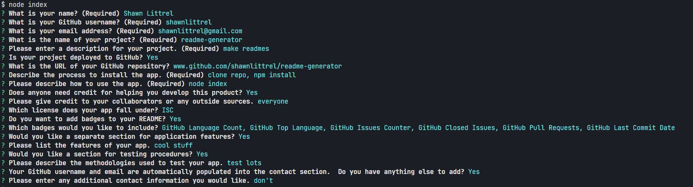
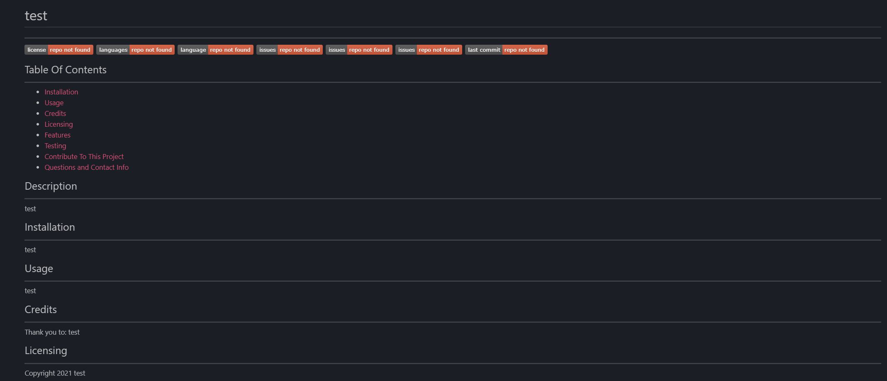

    
# readme-generator
---
    
    
                  
---

    
## Table Of Contents
---
* [Installation](#installation)
* [Usage](#usage)
* [Credits](#credits)
* [Licensing](#licensing)
* [Features](#features)
* [Testing](#testing)
* [Contribute To This Project](#contribute)
* [Questions and Contact Info](#questions-and-contact)

    
## Description
---
Generate readmes from a command line interface.
    

    
## Installation
---
Clone the repository from GitHub, then 'npm install' from the command line.

    
## Usage
---
Start the app with 'node index' and then follow the prompts.  The file will be generated as NEWREADME.md and can be manipulated as needed from there.

### Screenshots
---

---

---

    
## Credits
---
Thank you to:
Everyone in my bootcamp that answered my questions.

    
## Licensing
---
Copyright 2021 Shawn Littrel 
    
    Permission is hereby granted, free of charge, to any person obtaining a copy of this software and associated documentation files (the "Software"), to deal in the Software without restriction, including without limitation the rights to use, copy, modify, merge, publish, distribute, sublicense, and/or sell copies of the Software, and to permit persons to whom the Software is furnished to do so, subject to the following conditions:  
        
    The above copyright notice and this permission notice shall be included in all copies or substantial portions of the Software. 
        
    THE SOFTWARE IS PROVIDED "AS IS", WITHOUT WARRANTY OF ANY KIND, EXPRESS OR IMPLIED, INCLUDING BUT NOT LIMITED TO THE WARRANTIES OF MERCHANTABILITY, FITNESS FOR A PARTICULAR PURPOSE AND NONINFRINGEMENT. IN NO EVENT SHALL THE AUTHORS OR COPYRIGHT HOLDERS BE LIABLE FOR ANY CLAIM, DAMAGES OR OTHER LIABILITY, WHETHER IN AN ACTION OF CONTRACT, TORT OR OTHERWISE, ARISING FROM, OUT OF OR IN CONNECTION WITH THE SOFTWARE OR THE USE OR OTHER DEALINGS IN THE SOFTWARE.

    
## Features
---
Lots of fun colors and text in the command line.

    
## Testing
---
I filled out the prompts until the code broke.  When it stopped breaking, I knew the app was complete.

    
## Contribute
---
Want to contribute to this project?  Please make a pull request at www.github.com/shawnlittrel/readme-generator

    
## Questions And Contact
---
* Author: [Shawn Littrel](www.github.com/shawnlittrel)
* GitHub: (www.github.com/shawnlittrel/readme-generator)
* Email: shawnlittrel@gmail.com
    
    
